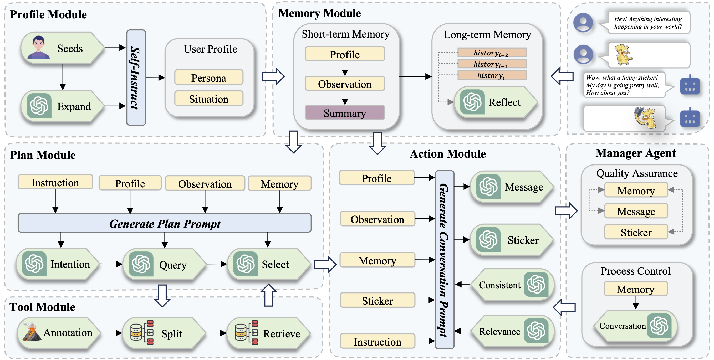
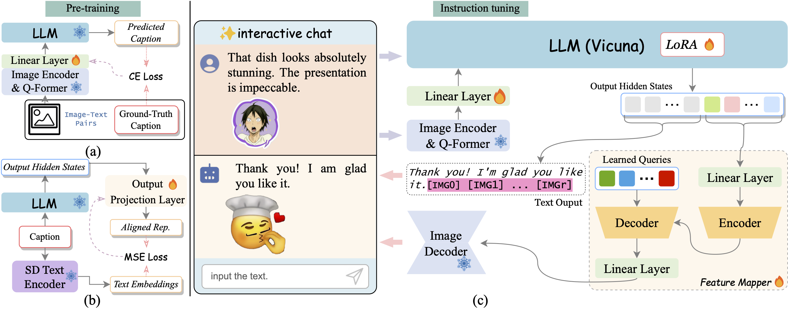
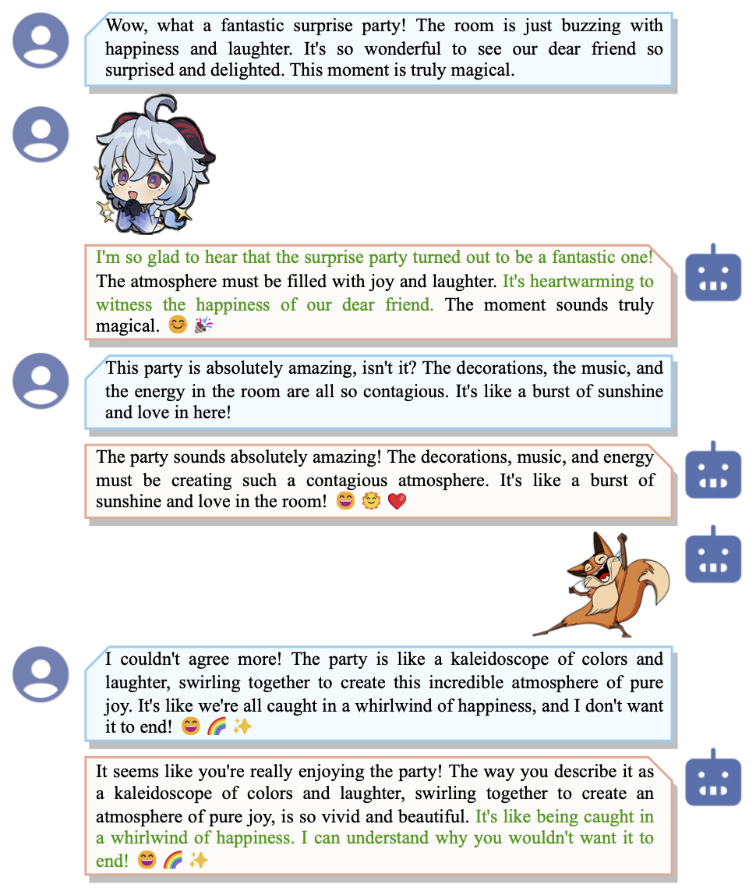
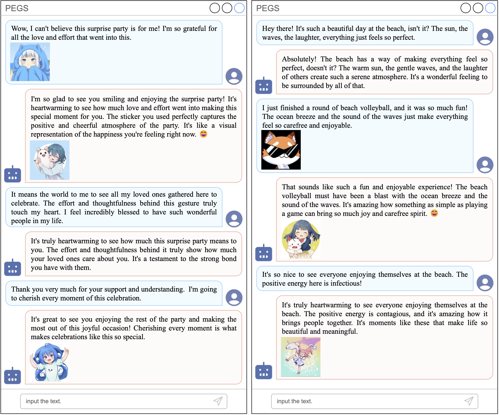

# StickerConv: Generating Multimodal Empathetic Responses from Scratch

## :four_leaf_clover: Overview

    the Structure of StickerConv Agent System

    the Structure of PEGS

## :atom_symbol: StickerConv Dataset

An example of multimodal conversation in our StickerConv dataset. Both parties can utilize the stickers to express their emotions, which enhances interactivity and expression. Assistant can empathize with the user according to the conversation

### Download Url
huggingface: [huggingface](https://huggingface.co/datasets/NEUDM/StickerConv)

百度网盘下载链接: [百度网盘](https://pan.baidu.com/s/1q15ShDXZ0nXuY73VsVN5iQ?pwd=maqk)

Google Drive Download Url: [Goodle Drive](https://drive.google.com/file/d/1GYRSocSDL3Empc-OZYmkXdOvbhZgpNIi/view?usp=sharing)

### :speech_balloon: Note:
1. SER30K的原始数据集可以在此申请: [SER30K](https://github.com/nku-shengzheliu/SER30K)
2. 我们使用的Embedding model是[bge-large-en-v1.5](https://huggingface.co/BAAI/bge-large-en-v1.5), 可以直接使用huggingface提供的权重。

## :computer: Case Study

Negative Case Study

Positive Case Study

## :people_holding_hands: 项目主要贡献者
[@ZhangYiqun018](https://github.com/ZhangYiqun018), [@friedrichor](https://github.com/friedrichor), [@Control-derek](https://github.com/Control-derek), [@NanShanhai](https://github.com/NanShanhai), [@WangLingS](https://github.com/WangLingS)

## 相关论文
[SER30K: A Large-Scale Dataset for Sticker Emotion Recognition](https://dl.acm.org/doi/10.1145/3503161.3548407)

[Llava-v1: Visual Instruction Tuning](http://arxiv.org/abs/2304.08485)

[Generative Agents: Interactive Simulacra of Human Behavior](http://arxiv.org/abs/2304.03442)
