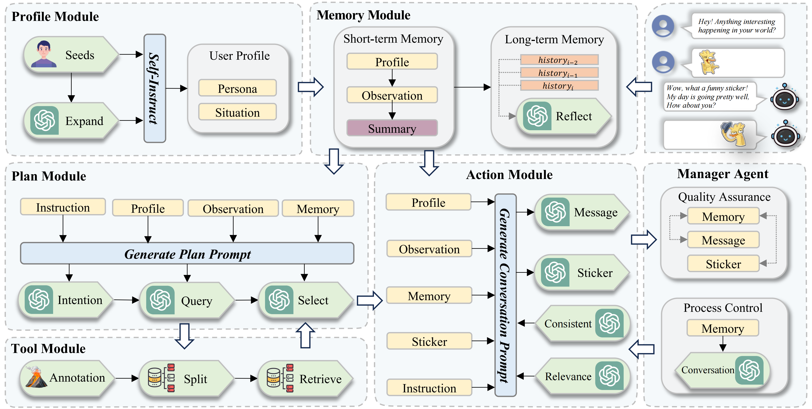
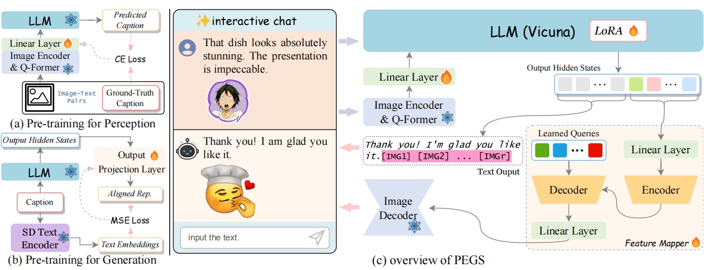
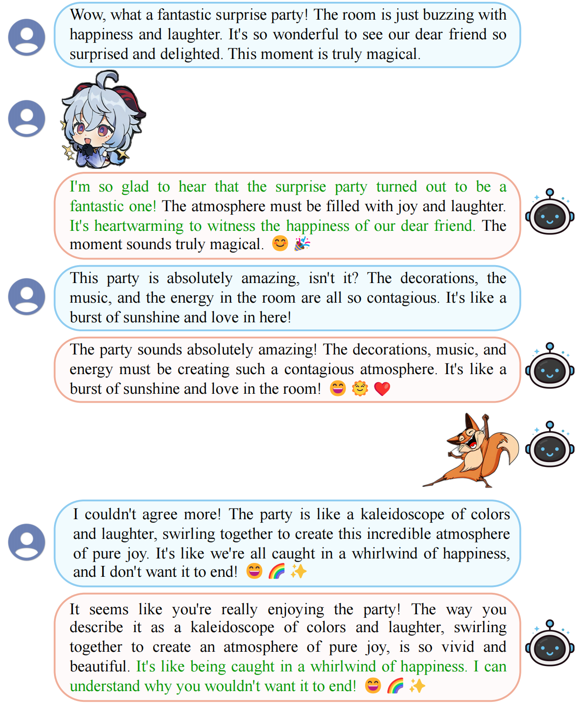

# StickerConv: Generating Multimodal Empathetic Responses from Scratch

   

## Update

- **2024-05-16:** Our paper is accepted by **ACL 2024 Main**! 🎉
- **2024-02-16:** Submission version.
- **2024-01-20:** Ongoing work.

## :four_leaf_clover: Overview

    The overview of Agent4SC.

    The architecture of PEGS framework.

## :atom_symbol: StickerConv Dataset

An example of multimodal conversation in our StickerConv dataset.

## :computer: Case Study

Examples of conversations by users interacting with PEGS. Users can chat with multimodal content (text and stickers) and will receive multimodal empathetic responses. Left: a conversation characterized by positive emotion (happiness). Right: a conversation characterized by negative emotion (sadness).

## :four_leaf_clover: Overview

## Related Work
[SER30K: A Large-Scale Dataset for Sticker Emotion Recognition](https://dl.acm.org/doi/10.1145/3503161.3548407)

[Llava-v1: Visual Instruction Tuning](http://arxiv.org/abs/2304.08485)

[Generative Agents: Interactive Simulacra of Human Behavior](http://arxiv.org/abs/2304.03442)
 
