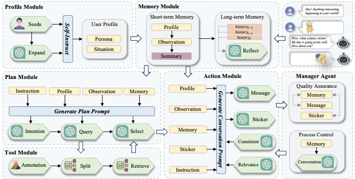

# :rainbow:StickerChat: Generating Multimodal Empathetic Responses from Scratch

## :four_leaf_clover:Overview

## :atom_symbol:dataset

百度网盘下载链接: [百度网盘](https://pan.baidu.com/s/1q15ShDXZ0nXuY73VsVN5iQ?pwd=maqk)

Google Drive download url: [Goodle Drive](https://drive.google.com/file/d/1GYRSocSDL3Empc-OZYmkXdOvbhZgpNIi/view?usp=sharing)

Note: 我们使用的Embedding model是bge-large-en-v1.5, 可以直接使用huggingface提供的权重。

## :placard:Examples

Qualitative examples from our PEGS model.

|   |   |
:-------------------------:|:-------------------------:
 | 
 | 

## :people_holding_hands:项目主要贡献者
[@ZhangYiqun018](https://github.com/ZhangYiqun018), [@friedrichor](https://github.com/friedrichor), [@Control-derek](https://github.com/Control-derek), [@NanShanhai](https://github.com/NanShanhai), [@WangLingS](https://github.com/WangLingS)